# Alzheimer Care System Application
## Introduction :
Alzheimer is a progressive neurological disorder that shrinks the brain and causes the brain cells to die[1].
As Alzheimer’s disease develops, problems with memory loss, communication, reasoning, and orientation become more severe and the person will require more day-to-day support and assistance from others. This is why we introduce Alzheimer Care System (ACS).
* Alzheimer Care System Application (ACS) :
It is a mobile application based on Flutter.
It has been specifically designed for Alzheimer's 
patients, their caregivers, and their doctors.
ACS contains many  features such as:
* Test to check the mental and cognitive status of the person.
* Brain training games.
* Assistant chatbot.
* Notifying the patient of the time of his daily tasks such as medication time and to do list.
* Sending the current location of the patient. 
* Messages between the patient and his caregiver or doctor
* Memories and favorites gallery for the patient.
In addition, this application is in Arabic and English.
## Tech Stack

**Programming Language:** Dart, Flutter

**Server:** Firebase

**IDE:** Android Studio

**API used:** Google maps, DialogFlow

## Screenshot of Chatbot Flow Diagram
Flow diagram is a diagram that describes the flow of the chatbot. 
The diagram above shows the flow of the operation of 
the chatbot. When the chatbot receives a question,
 it first checks if the question exists in the database. 
 If the chatbot doesn’t have that question in its database, it doesn’t have an answer for it. In that case, the chatbot sends a message to the 
person who asked, informing him that it doesn’t 
have an appropriate answer. 
If the question is static and the chatbot has that question in its database, it checks which intent will match this question to return the answer directly. 

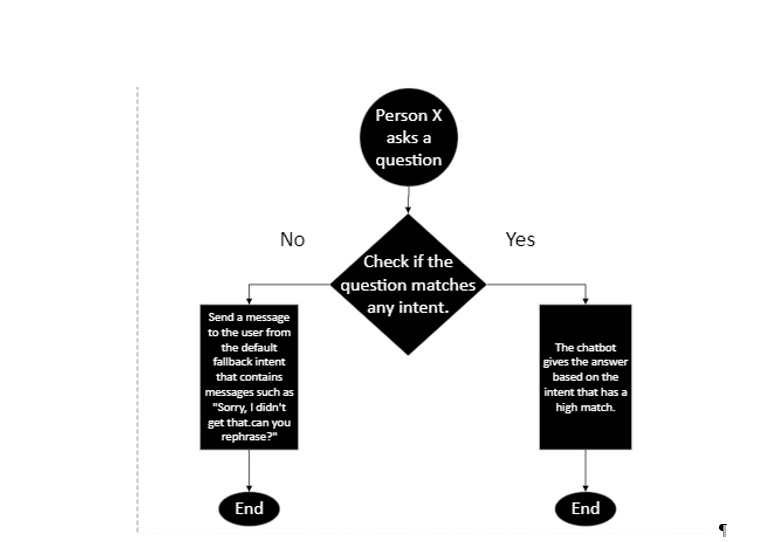

## Features

- All interfaces exist in Arabic and English language
- Connect patients with caregivers
- Connect patients with doctors
- Chatbot responds to general questions about Alzheimer's disease, such as its definition, symptoms...
- Ease of Use

## Some Screenshots of the App
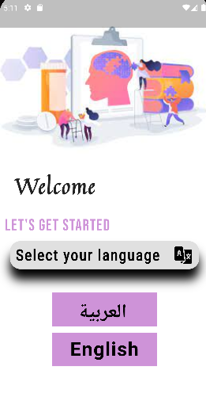
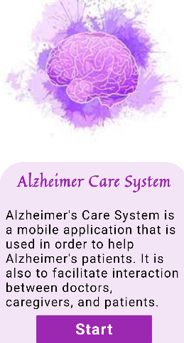
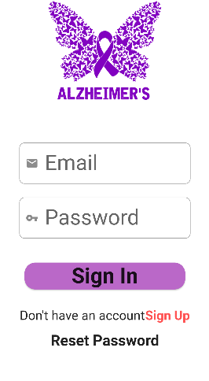
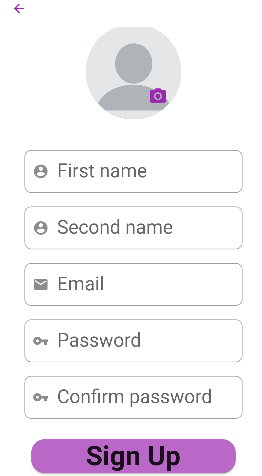
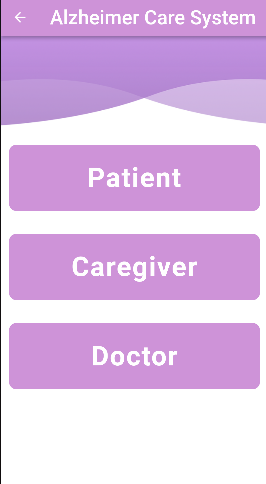

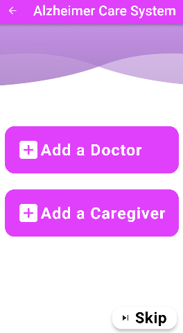

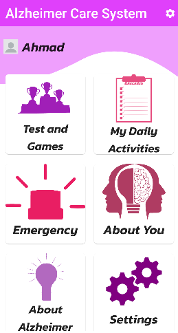
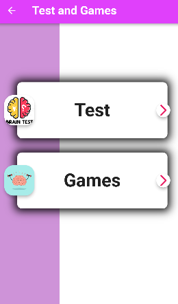
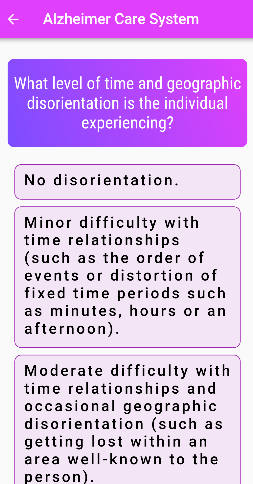

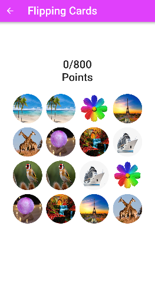
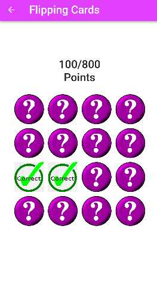
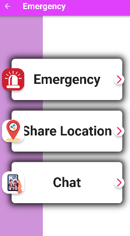
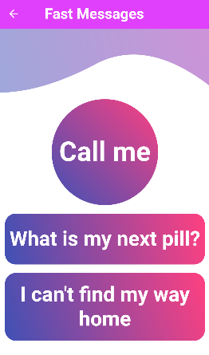
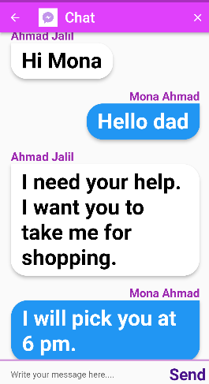
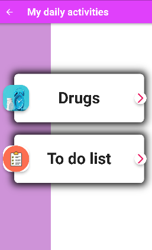
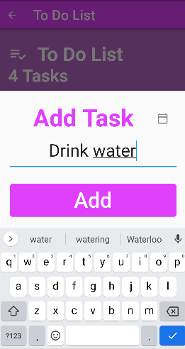
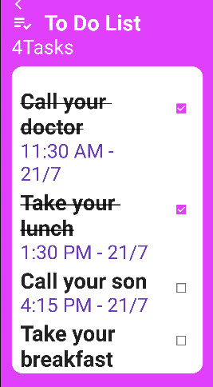
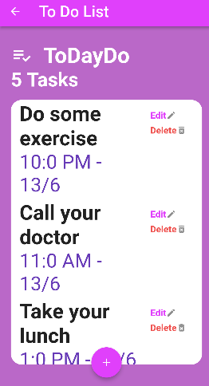
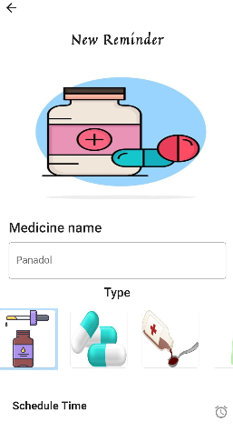
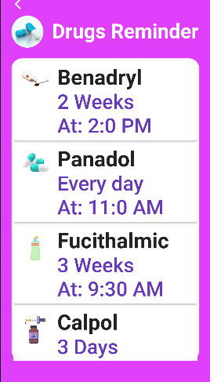
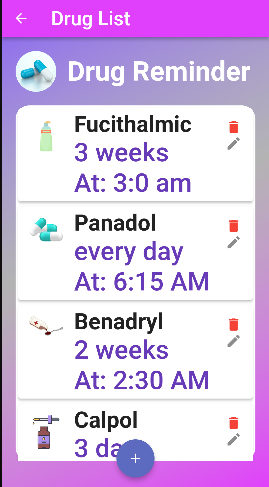
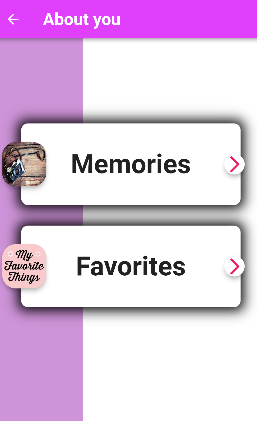
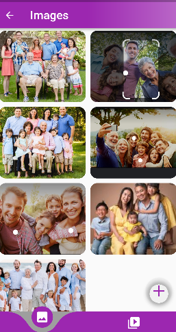
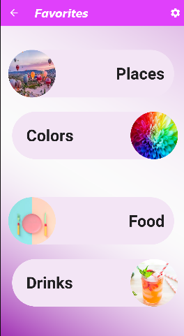
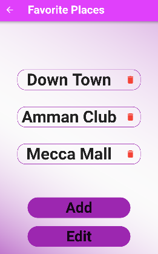
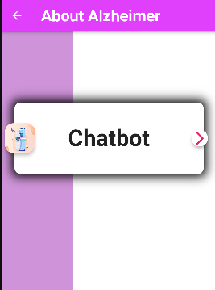
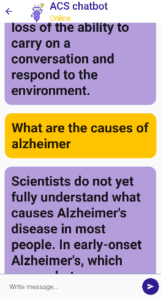
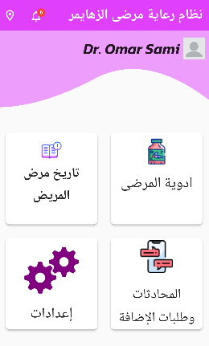
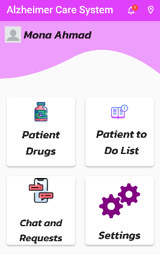
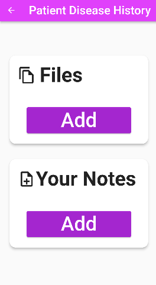
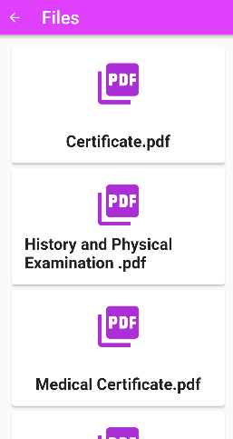
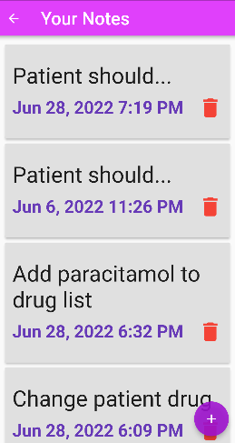
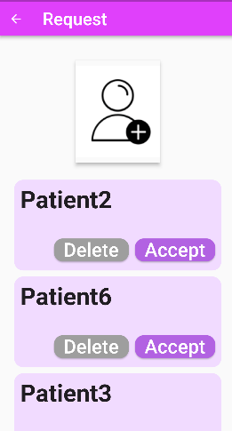
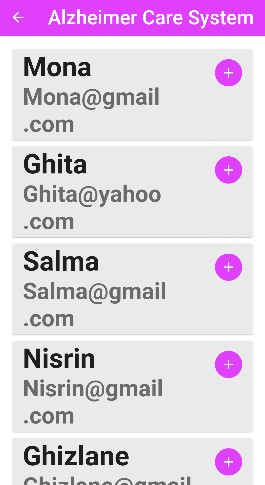

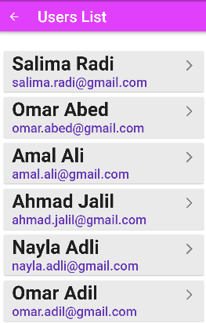
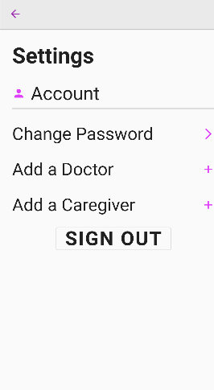
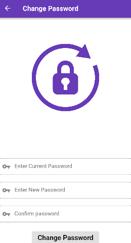
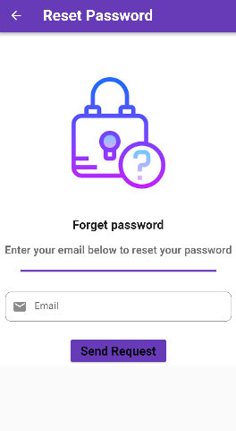

## Conclusions:
Mobile devices can be used to provide customized and integrated support for Alzheimer's patients, caregivers, and doctors.
ACS is a mobile application developed for Alzheimer's
patients that assists them in their daily lives through adding drug and to-do list reminders, 
sharing their location, facilitating communication between them and their caregivers and doctors. 
This system concerns Alzheimer's patients in the early stages 
to help them in the early stages of Alzheimer's in their daily lives so they can remain independent at least until they enter the late mid-stages or late stages.

## Reference
[1]	D. Patterson and J. Hennessy, Computer Architecture: A Quantitative Approach, 5th edition, Morgan Kaufman, 2011. 
